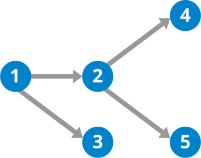
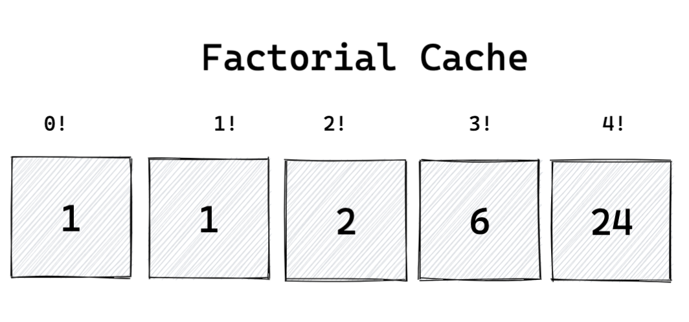
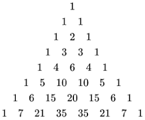
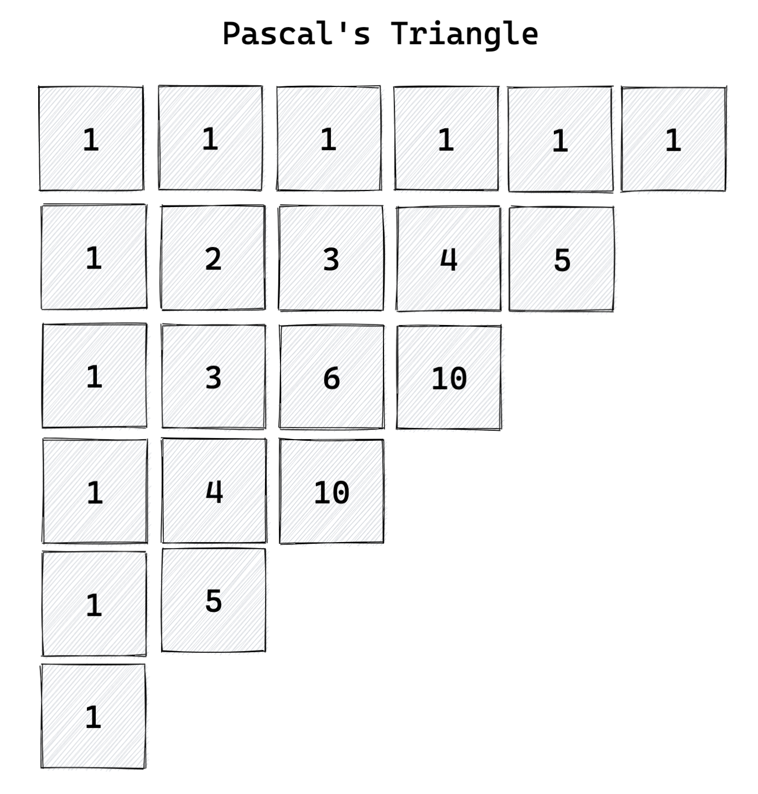

% Week 8: Dynamic Programming
% Robert Balicki
% 20-09-24

TOC

* Dynamic programming vs recursion
* Caching
* Building data structures and Big O notation

---

What is dynamic programming?

::: incremental

* Build up from smaller problems to a bigger problem
* e.g. calculating the 100th fibonacci number by starting from the first

:::

---

Wait, isn't that the same as recursion?

::: incremental

* Recursion: start from big problem and solve smaller problems until you reach easy problems
* Dynamic programming: start from easy problems and solve bigger problems until you reach the big problem

:::

--- 

Compare

* Let's look at the factorial function, where `factorial(n)` is `n * (n - 1) * ... * 1`.

---

Compare

<pre>
<code class="small-code">
function recursiveFactorial(n) {
  if (n === 0) {
    return 1;
  } else {
    return n * recursiveFactorial(n - 1);
  }
}
</code>
</pre>

---

Compare

<pre>
<code class="small-code">
function dynamicProgrammingFactorial(n) {
  let product = 1;
  for (i = 1; i <= n; i++) {
    product = i * product;
  }
  return product;
}
</code>
</pre>

---

Key lines

<pre>
<code class="small-code">
return n * recursiveFactorial(n - 1);
product = i * product;
</code>
</pre>
---

Expand that out

```
// recursive
factorial(2) = 2 * factorial(1)
             = 2 * 1 * factorial(0)
             = 2 * 1 * 1;

// dynamic
product = 1
product = 1 * product = 1 * 1
product = 2 * product = 2 * 1 * 1
```

---

When can you use which algorithm?

::: incremental

* Use recursion when you know how to get from big to small problems
* Use dynamic programming when you know how to get from small to big problems

:::

---

DFS on a graph



---

Now you try it!

* Implement a function that returns the nth fibonacci number using dynamic programming
* Remember, fib(1) = 1, fib(2) = 1, and fib(n) = fib(n-1) + fib(n-2)

---

How does this relate to caching?

::: incremental

* Caching is keeping track of results we've already calculated
* In order to avoid unnecessary work

:::

---

Add a cache to dynamicProgrammingFactorial

<pre>
<code class="small-code">
function dynamicProgrammingFactorial(n) {
  <old>let product = 1;</old>
  <new>let products = [1];</new>
  for (i = 1; i <= n; i++) {
    <old>product = i * product;</old>
    <new>products.push(i * products[i - 1]);</new>
  }
  <old>return product;</old>
  <new>return products[n];</new>
}
</code>
</pre>

---

You're right!


<pre>
<code class="small-code">
<new>let products = [1];</new>
function dynamicProgrammingFactorial(n) {
  <old>let products = [1];</old>
  for (i = products.length; i <= n; i++) {
    products.push(i * products[i - 1]);
  }
  return products[n];
}
</code>
</pre>

---

You're even more right!

<pre>
<code class="small-code">
<new>const getFactorialFn = () => {</new>
  let products = [1];
  <new>return</new> function dynamicProgrammingFactorial(n) {
    for (i = products.length; i <= n; i++) {
      products.push(i * products[i - 1]);
    }
    return products[n];
  };
<new>};</new>
</code>
</pre>

---

Now you try it!

* Add a cache to the existing dynamic programming fibonacci calculator

---

{width=500}

---

What are we doing?

::: incremental

* Creating a data structure that is one-dimensional, because
* there is only one positive number we need for the parameters
* Remember, arrays answer the question "given a number, give me an item"

:::

---

What are we doing?

::: incremental

* We can build up a different data structure.
* What data structure answers the question "given a string, give me an item"?
* Answer: A hashmap
* What data structure answers the question "given two numbers, give me an item?"
* Answer: a nested array

:::

---

Pascals triangle



---

{width=500}

---

How is a Pascal number defined?

::: incremental

* Pascal(i, j) = 0 if i < 0 or j < 0, otherwise
* Pascal(i - 1, j)  + Pascal(i, j - 1)

:::

---

Now you try it!

* Calculate the (i, j)th Pascal number recursively, first without caching and then with caching

---

Let's do this dynamically!

::: incremental

* Create a nested array `cache`, where `cache[i, j] = Pascal(i, j)`

:::

---

```
function pascal(r, c) {
  const cache = [];
  for (const i = 0; i <= r; i++) {
    cache[i] = [];
    for (const j = 0; j <= c; j++) {
      const valueToTheLeft = j === 0 ? 0 : cache[i][j - 1];
      const valueAbove = i === 0 ? 0 : cache[i - 1][j];
      cache[i][j] = valueToTheLeft + valueAbove;
    }
    return cache[r][c];
}
```

---

Okay, shit's about to get weird!

---


